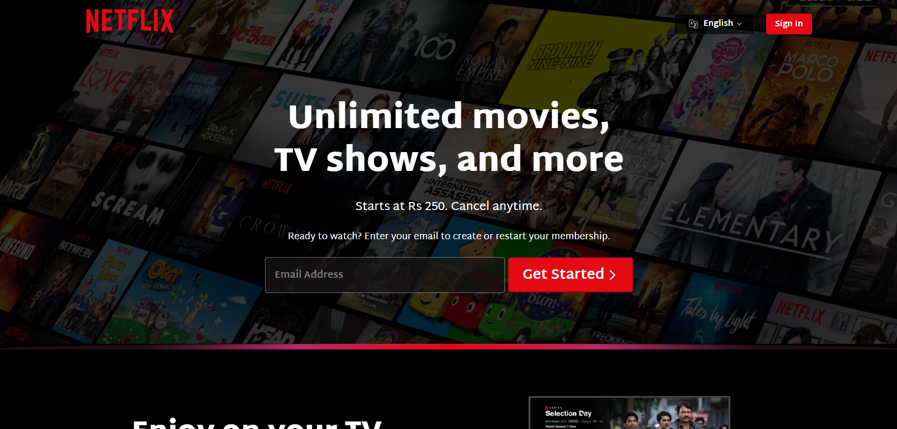
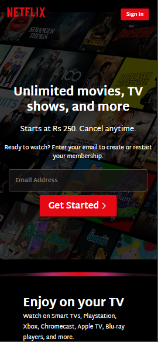

# 📺 Netflix UI Clone

A responsive front-end clone of Netflix's homepage built using **HTML** and **CSS**. This project focuses purely on UI design to replicate the look and feel of the original Netflix landing page.

## 🔗 Live Demo

👉 [Click here to view the live project](https://hassaanmemon026.github.io/NETFLIX-Clone/)  

---

## 📸 Screenshots

| Desktop View | Mobile View |
|--------------|-------------|
|  |  |

---

## 🛠️ Technologies Used

- **HTML5**
- **CSS3**
- **Responsive Design**
- **Custom Layouts**
- **Media Queries**
- **Google Fonts**

---

## 📂 Folder Structure

Netflix-UI-Clone/
├── assets/
│ ├── Images/
│ └── Videos/
├── index.html
├── style.css
└── README.md

---

## ✅ Features

- ✅ Fully responsive layout (Desktop & Mobile)
- ✅ Custom buttons and layout matching Netflix UI
- ✅ Language and Sign-in UI (static)
- ✅ Animated video sections just like original Netflix
- ✅ FAQ section with collapsible boxes (static)
- ✅ Footer with multiple dummy links
- ✅ Clean and readable code structure

---

## 🚧 Limitations

This is only a **static UI clone**:
- ❌ No backend functionality (Sign In / Subscription)
- ❌ No dynamic FAQ toggling
- ❌ No real email handling or authentication

---

## 🤝 Contributing

Pull requests are welcome. For major changes, please open an issue first to discuss what you'd like to change.

---

## 👨‍💻 Author

- **Muhammad Hassaan**  
  [GitHub Profile](https://github.com/HassaanMemon026)

---

## 📄 License

This project is open-source and available under the [MIT License](LICENSE).

---

## 📬 Contact

For feedback, reach out via GitHub or email: [hassaanraza026@gmail.com](https://hassaanraza026@gmail.com)

---

> ⚠️ This project is for educational and portfolio purposes only. Netflix is a trademark of Netflix, Inc. This clone is not intended to be a full reproduction or to infringe on copyrights.
